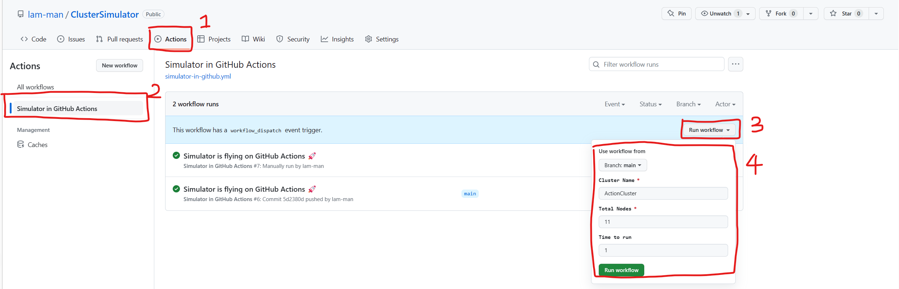
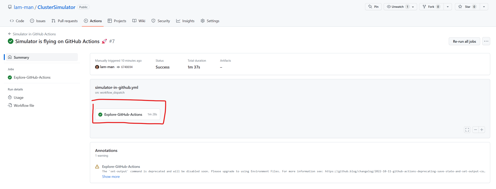
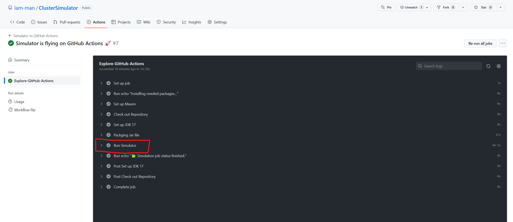

# ClusterSimulator

## How to compile and run
### Run with Github Actions (Recommended)
- Go to [Github Actions](https://github.com/lam-man/ClusterSimulator/actions]
- Select the workflow Simulator in GitHub Actions
- Click `Run workflow` and provide the input
  - Provide the cluster name and total nodes. You can also configure the optional run time.
  - Steps in screenshot
    
- Check the result by refreshing the page
  - Go to the newest workflow run
  - Steps in screenshot
    
- Check the result in log
  - Steps in screenshot
    

### Run in Local
- Compile command
  `mvn clean compile package`
- Jar file path
  After you run the above command, you should be able to find the `jar` file in `./target` folder.
- Run jar file in terminal
  Simulation program is harded coded to run 5 minutes.
  - `cd target`
  - `java -jar ClusterSimulation-1.0-SNAPSHOT.jar "myCluster" 17`
    - First parameter is cluster name
    - Second parameter for total nodes of the cluster.
- Expected result sample
  - [17-nodes.log](./assets/17-nodes.log)

## Possible optimizations
- Make ChaosMonkey more realistic
  - Currently, ChaosMonkey is started within the cluster and it is single threaded. It is not realistic. In real world, ChaosMonkey should be started from outside of the cluster in a separate thread.
  - Fault and update could happen at the same time. However, the current simulation makes them randomly happen one after another.

